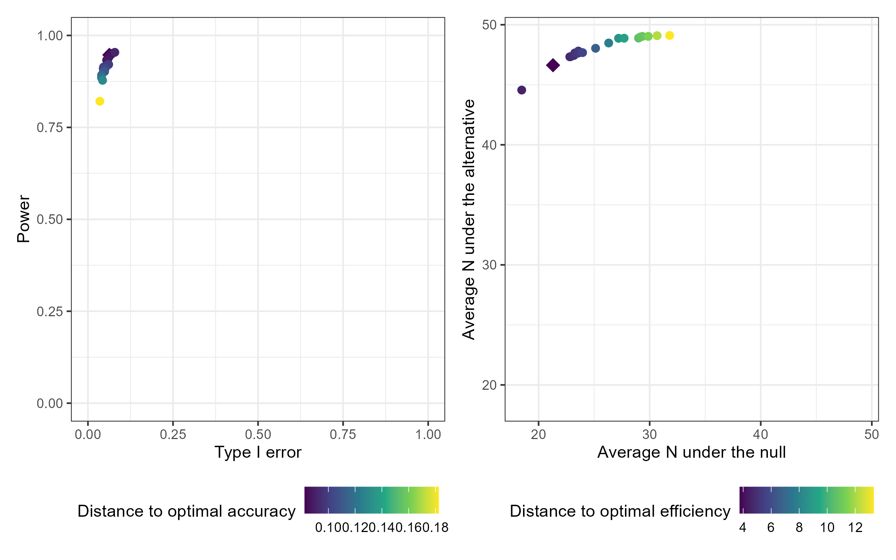
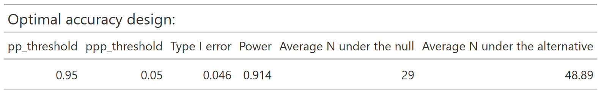

<!-- README.md is generated from README.Rmd. Please edit that file -->

```{r setup, include = FALSE}
knitr::opts_chunk$set(
  collapse = TRUE,
  warning = FALSE,
  comment = "#>",
  fig.path = "man/figures/README-",
  out.width = "100%"
)
```

<!-- badges: start -->
[](https://github.com/zabore/ppseq/actions)
[](https://app.codecov.io/gh/zabore/ppseq?branch=main)
[](https://CRAN.R-project.org/package=ppseq)
[](https://lifecycle.r-lib.org/articles/stages.html#stable)
<!-- badges: end -->

<br>
<br>

## ppseq

The {ppseq} package provides functions to design clinical trials using Bayesian sequential predictive probability monitoring. Functionality is available to design [one-arm](https://www.emilyzabor.me/ppseq/articles/one_sample_expansion.html) or [two-arm](https://www.emilyzabor.me/ppseq/articles/two_sample_randomized.html) trials by searching over a grid of combinations of posterior and predictive thresholds and identifying the optimal design according to two criteria: accuracy and efficiency. Interactive plotting allows easy comparison of the various design options and easy trial implementation through decision rule plots.


## Installation


You can install the production version of ppseq from CRAN with:

```r
install.packages("ppseq")
```


Or you can install the development version of ppseq from GitHub with:

```r
remotes::install_github("zabore/ppseq")
```


## Basic usage

```{r eval = FALSE}
library(ppseq)
```

The primary function to search over a grid of combinations of posterior and predictive thresholds for a certain trial design is `calibrate_thresholds()`. This function is computationally intensive to varying degrees depending on the number of looks and the number of threshold combinations, and is best run on a server and/or with parallelization.

```{r eval = FALSE}
set.seed(12345)

calthresh <-
  calibrate_thresholds(
    p_null = c(0.2, 0.2),
    p_alt = c(0.2, 0.5),
    n = cbind(seq(10, 50, 10), seq(10, 50, 10)),
    N = c(50, 50),
    pp_threshold = seq(0.9, 0.95, 0.01),
    ppp_threshold = seq(0.05, 0.2, 0.05),
    delta = 0
    )
```

The resulting design options can be compared interactively compared by passing the results to `plot()` with the option `plotly = TRUE`. Static versions of the plots are also available using the default option `plotly = FALSE`, which produces `ggplot` results. Plot output can optionally be filtered by desired range of type 1 error and minimum power. The default plots all design options. The results can also be viewed in tabular form by passing the results to `print()` with filtering options for the desired range of type 1 error and minimum power.

```{r eval = FALSE}
plot(calthresh)
```

```{r echo = FALSE}

```

The optimal accuracy and optimal efficiency designs can be obtained by passing the results to the `optimize_design()` function, with filtering applied for the desired range of type 1 error and minimum power.

```{r eval = FALSE}
optimize_design(calthresh, type1_range = c(0.025, 0.05), minimum_power = 0.8)
```

```{r echo = FALSE}

knitr::include_graphics("man/figures/README-opt-eff-table.png")
```

After selecting a design, we can obtain a set of decision rules to implement the trial, so that no calculations will be needed during the course of the trial. The `calc_decision_rules()` function will generate the decision rules to stop or continue at each interim look of the trial. 

```{r eval = FALSE}
set.seed(123456)

opteffrules <- 
  calc_decision_rules(
    n = cbind(seq(10, 50, 10), seq(10, 50, 10)),
    N = c(50, 50),
    theta = 0.94,
    ppp = 0.2,
    p0 = NULL, 
    delta = 0
  )
```

The results can be displayed with interactive graphics by passing the results to `plot()` with the default option `plotly = TRUE`. Below are the static `ggplot` versions created with the option `plotly = FALSE` for demonstration purposes. Tabular results can be obtained by passing the results to `print()`.

```{r eval = FALSE}
plot(opteffrules, plotly = FALSE)
```

```{r echo = FALSE}
knitr::include_graphics("D:/ppseq/man/figures/README-opteffrules-plot.png")
```

See the vignettes for the [one-sample](https://www.emilyzabor.me/ppseq/articles/one_sample_expansion.html) and [two-sample](https://www.emilyzabor.me/ppseq/articles/two_sample_randomized.html) cases for additional details about available features and options.


